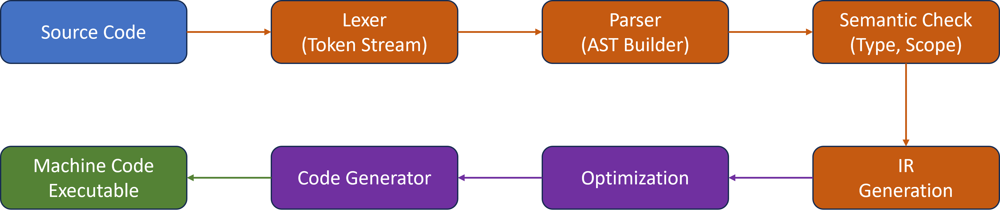

# MiniC Compiler Architecture

This document describes teh overall architecture of the MiniC compiler, including its major components, data flows, and design principles. The goal is to provide a clear and modular structure that supports learning, experimentation, and future extensions.

---

## 1. Overview

The miniC compiler is organized into several well-defined stages, each responsible for a specific part of teh compilation process:

1. **Lexical Analysis (Lexer)**
2. **Syntax Analysis (Parser)**
3. **Semantic Analysis**
4. **Intermediate Representation (IR) Generation**
5. **Optimization (Optional)**
6. **Code Generation**
7. **Runtime Support (Optional)**

Each stage transforms the input program into a more structured or lower-level form, ultimately producing executable outut or an intermediate format.

---

## 2. High-Level Architecture Diagram

---

## 3. Components

### 3.1 Lexer (Lexical Analysis)

The lexer read raw source code and converts it into a stream of **tokens**.

Responsiblities:

- Remove whitespace and comments
- Identify keywords, identifiers, literals, and operators
- Report lexical errors

Output:

- A sequence of tokens with type and source location

### 3.2 Parser (Syntax Analysis)

The parser consumes the token stream and constructs and **Abstract Syntax Tree (AST)**.

Responsibilities:

- Validate syntax according to the MiniC grammar
- Build structured AST nodes
- Report syntax errors with meaningfulk messages

Output:

- AST representing the program structure

### 3.3 Semnatic Analysis

Semantic analysis ensures that the AST is **meaningful** and **type-correct**

Responsibilities:

- Scope management (symbol tables)
- Type Checking
- Detecting undefined variables or functions
- Ensuring return statements match function types

Output:

- Annotated AST with type information

### 3.4 Intermediate Representation (IR)

The IR is a simplifiedm low-level representation of the program.

Designed goals:

- Easy to analyze
- Easy to optimize
- Easy to translate into machine code or bytecode

Typical IR features:

- Three-address code (TAC)
- SSA form (optional)
- Explicit temporary variables

Output:

- IR instructions representing program logic

### 3.5 Optimization (Optional)

MiniC may include simple optimizations such as:

- Constant folding
- Dead code elimination
- Algebraic simplification
- Copy propagation

This stage is optional and can be expanded later

### 3.6 Code Generation

The code generator converts IR into the final output format.

Possible targets:

- A custom virtual machine bytecode
- Assembly for a real CPU (e.g. x86, RISC-V)
- A stack-based interpreter format

Responsibilities:

- Register or stack allocation
- Instruction selection
- Emitting final code

### 3.7 Runtime Support (Optional)

If MiniC includes features like:

- I/O functions
- Memory management
- Built-in library functions

Then a small runtime system may be included.

---

## 4. Data Structures

### 4.1 Token

type: TokenType
lexeme: string
line: int
column: int

### 4.2 AST Nodes

Common node types:

- program
- Function
- Block
- Variable Declaration
- Binary Expression
- Unary Expression
- Literal
- if / while / return

### 4.3 Symbol Table

Maps identifiers to:

- Type
- Scope level
- Storage location

### 4.4 IR Instruction

Example TAC format
`t1 = a + b`
`if t1 < 10 goto L1`

---

## 5. Error Handling

The compiler should provideL

- Clear error messages
- Line and column information
- Recovery strategies (optional)

Types of errors:

- Lexical errors
- Syntax errors
- Semantic errors

---

## 6. Extensibility

The architecture is designed to support future features:

- Array and pointers
- Structs
- Modules
- More optimization passes
- Alternative backends (LLVM, WASM)

---

## 7. Summary

The miniC compiler follows a classic multi-stage design that separates concerns and keeps each component simple and modular. This architecture supports both educational clarity and pratical extensibility.
