# Design Guide for MiniC Parser

This document provides a concise overview of the MiniC parser design. It explains the parser architecture, core parsing flow, and key design decisions for building a clean and extensible syntax front-end.

The MiniC parser follows a handwritten recursive-descent approach. The implementation is designed to be
- clear and easy to maintain
- deterministic and easy to debug
- friendly to error reporting and recovery
- extensible for future semantic analysis and IR generation

At this stage, the parser focuses on converting lexer tokens into an AST according to the current MiniC grammar baseline.

---

## Table of Contents

1. [Purpose and Scope](#1-purpose-and-scope)
2. [Inputs and Outputs](#2-inputs-and-outputs)
3. [Grammar Baseline](#3-grammar-baseline)
4. [AST Model](#4-ast-model)
5. [Parser Architecture and State](#5-parser-architecture-and-state)
6. [Top-Level Parsing Flow](#6-top-level-parsing-flow)
7. [Statement Parsing Design](#7-statement-parsing-design)
8. [Expression Parsing Design](#8-expression-parsing-design)
9. [Error Handling and Recovery](#9-error-handling-and-recovery)
10. [Integration with Existing Modules](#10-integration-with-existing-modules)
11. [Testing Strategy](#11-testing-strategy)
12. [Milestones and Deliverables](#12-milestones-and-deliverables)
13. [Extension Points](#13-extension-points)

---

## 1. Purpose and Scope

The MiniC parser is responsible for transforming a token stream into a structured Abstract Syntax Tree (AST) based on the MiniC grammar. Its goal is to provide a reliable syntax front-end that is easy to extend and integrate with later compiler stages.

**Purpose**
- Parse MiniC source code according to the current grammar baseline.
- Build AST nodes that preserve program structure for downstream phases.
- Provide clear syntax diagnostics with accurate source positions
- Support basic error recovery so parsing can continue after common syntax errors.

**Scope (Current Stage)**
The parser currently targets:
- Program structure: function definitions as top-level units.
- Statements: declaration, expression statement, block, if/else, while, for, return.
- Expressions: assignment, logical, equality, relational, additive, multiplicative, unary, postfix call, and primary expressions.
- Function calls in postfix expressions.

**Out of Scope (Current Stage)**
The following are intentionally not handled in this parser phase:
- Semantic validation (type checking, symbol resolution, scope legality).
- IR generation or optimization.
- Advanced language features not in current grammar baseline (e.g. arrays, member access, pointers, structs, modules).

---

## 2. Inputs and Outputs

This section defines what the MiniC parser consumes and what it produces.

### 2.1 Input

The parser takes a token stream produced by the MiniC lexer.
Each token contains:
- token type
- lexeme text
- source location (line and column)

The parser assumes lexical analysis has already handled:
- whitespace and comment skipping
- token categorization (keyword, identifier, literal, operator, delimiter)
- lexical error token generation

### 2.2 Output

The parser produces an Abstract Syntax Tree (AST) for the whole source file.

Primary output:
- Program AST root node
- child nodes for function definitions, statements, and expressions

Auxiliary output:
- syntax diagnostics collected during parsing
- source-aware error message for invalid constructs

### 2.3 Error Handling Mode

The parser runs in recovery mode.

When a syntax error is encountered, the parser records a diagnostic, synchronizes to a safe boundary (such as `;`, `}`, or a statement starter), and continues parsing. This allows one compilation run to report multiple issues instead of stopping at the first error.

The parser may still stop early only when:
- the error count exceeds a configured maximum threshold
- an unrecoverable internal parser state is detected

### 2.4 Contract with Later Stages

The parser output is a syntax-level structure only. It does not guarantee semantic correctness (type validity, symbol resolution, callable checks). Those checks are delegated to semantic analysis.

---

## 3. Grammar Baseline

This section defines the syntax baseline used by the MiniC parser at the current stage.
The parser follows the grammar in the language specification and uses recursive-descent parsing with explicit precedence levels.

### 3.1 Top-Level Grammar

`program = function-definition*`
`function-definition = type identifier (parameter-list?) compound-statement`

`parameter-list = parameter (, parameter)*`
`parameter = type identifier`

`type = int | float | char | string | void`

`compound-statement = {statement*}`

### 3.2 Statement Grammar

```
statement = expression-statement
           | declaration
           | if-statement
           | while-statement
           | for-statement
           | return-statement
           | compound-statement
```

`expression-statement = expression?;`

`declaration = type identifier (= expression)?;`

`if-statement = if (expression) statement (else statement)?`

`while-statement = while (expression) statement`

`for-statement = for (for-init; for-condition?; for-update?) statement`

`for-init = declaration-no-semi | expression | ε`
`for-condition = expression`
`for-update = expression`
`declaration-no-semi = type identifier ("=" expression)?`

`return-statement = "return" expression? ";"`

### 3.3 Expression Grammar and Precedence

`expression = assignment`

`assignment = identifier "=" assignment | logical-or`

`logical-or = logical-and ("||" logical-and)*`
`logical-and = equality ("&&" equality)*`
`equality = relational (("==" | "!=") relational)*`
`relational = additive (("<" | ">" | "<=" | ">=") additive)*`
`additive = multiplicative (("+" | "-") multiplicative)*`
`multiplicative = unary (("*" | "/" | "%") unary)*`
`unary = ("!" | "-" | "+") unary | postfix`

`postfix = primary ("(" argument-list? ")")*`

`argument-list = expression ("," expression)*`

```
primary = identifier
        | literal
        | "(" expression ")"
```

```
literal = integer-literal
        | float-literal
        | char-literal
        | string-literal
```

### 3.4 Associativity Rules

- Assignment is right-associative.
- Binary logical, equality, relational, additive, and multiplicative operators are left-associative.
- Unary operators are prefix and bind tighter than binary operators
- Postfix function call has higher precedence than unary and binary operators.

### 3.5 Current Constraints and Notes

- Function calls in postfix form are supported syntactically, including chained calls.
- Call validity for intermediate results is a semantic-phase responsibility.
- Array indexing and member access are not part of the current baseline
- Grammar decisions prioritize deterministic parsing and straightforward error recovery

---

## 4. AST Model

This section defines the Abstract Syntax Tree generated by the MiniC parser. The AST is designed to be explicit, recovery-friendly, and easy to extend for semantic analysis and IR generation.

### 4.1 AST Hierarchy Overview

The AST is organized into four layers:
- `Program` as the root container of top-level declarations
- `FunctionDecl` as the executable unit under Program
- `Stmt` family for structural/control-flow syntax
- `Expr` family for value-producing syntax

**Design constraints:**
- Each source file produces exactly one Program node
- Each function body is represented as `BlockStmt`
- Statement and expression nodes stay in separate families

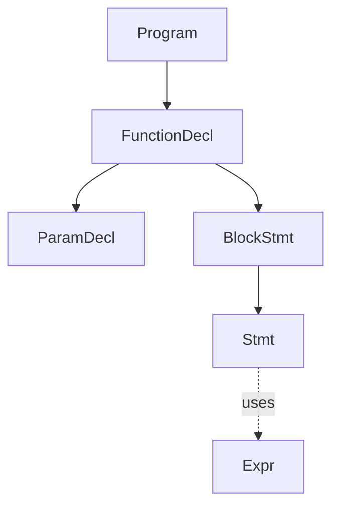

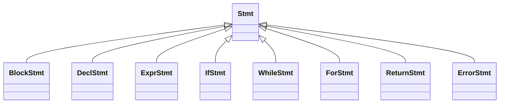

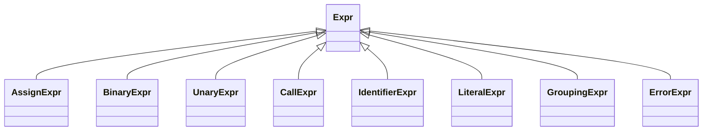

### 4.2 Core Node Definitions

**Program**
- functions: vector of FunctionDecl
- span: SourceSpan

**FunctionDecl**
- returnType: TypeName
- name: string
- params: vector of ParamDecl
- body: BlockStmt
- span: SourceSpan

**ParamDecl**
- type: TypeName
- name: string
- span: SourceSpan

**Stmt base family**
- BlockStmt: statements
- DeclStmt: type, name, optional init
- ExprStmt: optional expr
- IfStmt: condition, thenBranch, optional elseBranch
- WhileStmt: condition, body
- ForStmt: optional init, optional condition, optional update, body
- ReturnStmt: optional value
- ErrorStmt: recovery placeholder message

**Expr base family**
- AssignExpr: target, value
- BinaryExpr: op, left, right
- UnaryExpr: op, operand
- CallExpr: callee, args
- IdentifierExpr: name
- LiteralExpr: kind, lexeme
- GroupingExpr: inner
- ErrorExpr: recovery placeholder message

### 4.3 Source Location Model

Each node carries source location metadata for diagnostics.

**SourceLocation**
- line
- column

**SourceSpan**
- begin: SourceLocation
- end: SourceLocation

**Guideline**
- begin is the first token of the construct
- end is the last consumed token of the construct

### 4.4 Ownership and Memory Model

Use modern C++ single ownership:
- Node ownership uses `std::unique_ptr`
- Child collections use `std::vector` of `std::unique_ptr`
- Avoid shared mutable ownership in core AST
- Keep node construction centralized through helper/factory routines

This keeps lifetime management predictable and implementation clean.

### 4.5 Recovery-Aware AST Policy

The parser runs in recovery mode and should still produce an AST whenever possible.

**Recovery Rules**
- Preserve valid subtrees
- Represent invalid fragments as ErrorStmt or ErrorExpr
- Synchronize and continue parsing after recoverable errors
- Let later phases skip or downgrade checks on error nodes to reduce cascading diagnostics

### 4.6 Call Expression Extensibility

CallExpr uses callee as Expr, not identifier-only.

Why:
- Supports postfix call chaining syntax in parser
- Avoid AST redesign when adding C++-style callable expressions
- Keeps syntax acceptance separate from semantic callable validation

Callable validity remains a semantic-phase responsibility.

### 4.7 Example AST

Example source:
`return add(x, y + 1);`

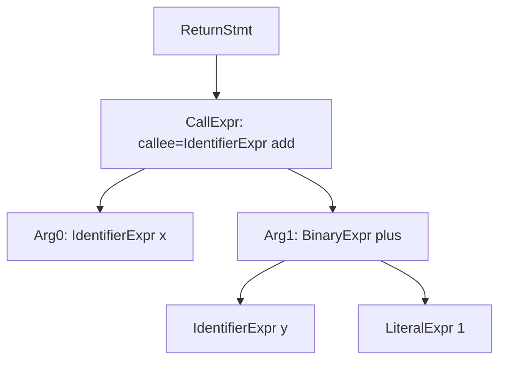

---

## 5. Parser Architecture and State

This section describes the internal structure of the MiniC parser, its parsing strategy, and the state it maintains during a parse run.

### 5.1 Parsing Strategy

The MiniC parser uses a handwritten recursive-descent approach.

Each grammar production maps directly to a dedicated parsing method. This gives the parser predictable control flow, easy debugging, and fine-grained error recovery.

Key properties:
- single-token lookahead is sufficient for all MiniC grammar rules
- no backtracking is required
- parsing is deterministic at every decision point

### 5.2 Internal State

The parser maintains the following state across a parse run:
- token stream: the sequence of tokens produced by the lexer
- current: index or pointer to the current token being examined
- diagnostics: accumulated list of syntax and lexical error messages
- errorCount: number of errors recorded so far
- panicMode: flag indicating the parser is currently recovering from an error

panicMode is used to suppress cascading diagnostics. Once the parser synchronizes to a safe boundary, panicMode is cleared and normal parsing resumes.

### 5.3 Public API

The parser exposes a minimal public interface:
- `parse()`: entry point, returns Program AST node and diagnostics
- `hasFatalError()`: returns true if error count exceeded threshold or unrecoverable state reached

### 5.4 Core Private Methods

Internal methods follow a one-method-per-production convention:

Top-level:
- `parseProgram`
- `parseFunctionDecl`
- `parseParamList`
- `parseType`

Statements:
- `parseStatement (dispatcher)`
- `parseBlockStmt`
- `parseDeclStmt`
- `parseExprStmt`
- `parseIfStmt`
- `parseWhileStmt`
- `parseForStmt`
- `parseReturnStmt`

Expressions:
- `parseExpression`
- `parseAssignment`
- `parseLogicalOr`
- `parseLogicalAnd`
- `parseEquality`
- `parseRelational`
- `parseAdditive`
- `parseMultiplicative`
- `parseUnary`
- `parsePostfix`
- `parsePrimary`

### 5.5 Token Consumption API

All token interactions go through a small set of primitives:
- `peek()`: returns the current token without consuming it
- `advance()`: consumes and returns the current token
- `check(type)`: returns true if the current token matches the given type
- `match(type)`: consumes and returns true is the current token matches, otherwise returns false
- `expect(type)`: consumes if match, otherwise records a diagnostic and triggers recovery

### 5.6 Parse Flow Overview

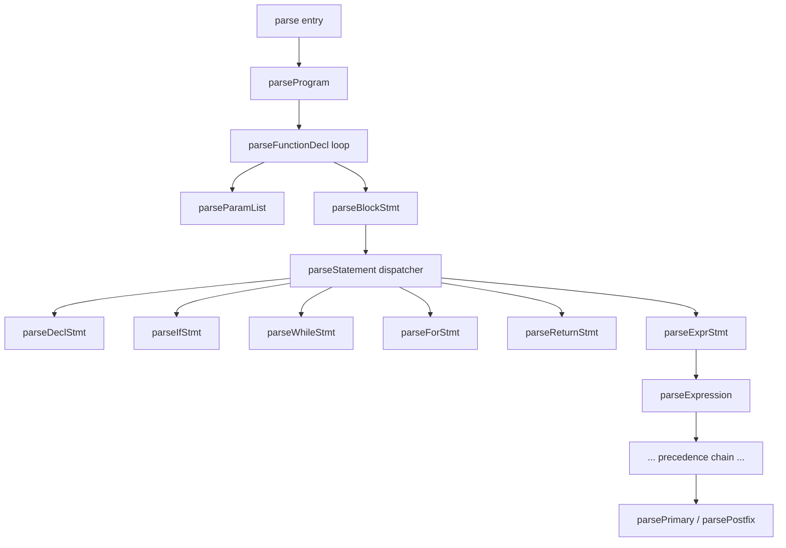

---

## 6. Top-Level Parsing Flow

This section defines how the parser constructs a full `Program` AST from a token stream at the top level.

### 6.1 Entry Point

`parse()` is the parser entry function.

**Responsibilities:**
- initialize parser state
- invoke `parseProgram()`
- return parse result:
    - `Program` AST root
    - diagnostics list
    - status flags (success, recovered-with-errors, aborted)

### 6.2 Program-Level Loop

`parseProgram()` parses until end-of-file.

High-level behavior:
- create empty `Program` node
- while current token is not EOF:
    - parse one top-level declaration
    - append it to `Program`
- return completed `Program`

At the current MiniC stage, top-level declarations are function definitions only.

### 6.3 Function Definition Parsing

`parseFunctionDecl()` handles:
- return type
- function name
- parameter list
- function body block

Expected shape:
`type identifier "(" parameter-list? ")" compound-statement`
If any required token is missing, the parser records diagnostics and recovers to the next safe top-level boundary.

### 6.4 Parameter List Parsing

`parseParamList()` is entered after consuming `"("`.

Rules:
- empty parameter list is allowed
- each parameter is `type identifier`
- parameters are comma-separated
- list ends at `")"`

Error handling:
- missing identifier after type -> diagnostic + local recovery
- missing comma or closing parenthesis -> diagnostic + synchronize to `")"` when possible

### 6.5 Type Parsing

`parseType()` accepts only grammar-defined type keywords at this stage:
- `int`
- `float`
- `char`
- `string`
- `void`

if current token is not a valid type keyword:
- emit diagnostic: expected type specifier
- return error marker type
- let caller decide recovery path

### 6.6 Top-Level Recovery Strategy

When top-level parsing fails inside a function declaration, synchronization targets are:
- next type keyword likely starting another function
- closing brace `"}"` of current damaged function body
- EOF

This keeps the parser moving forward and avoids cascading failures from one broken function.

### 6.7 Top-Level Flow Summary

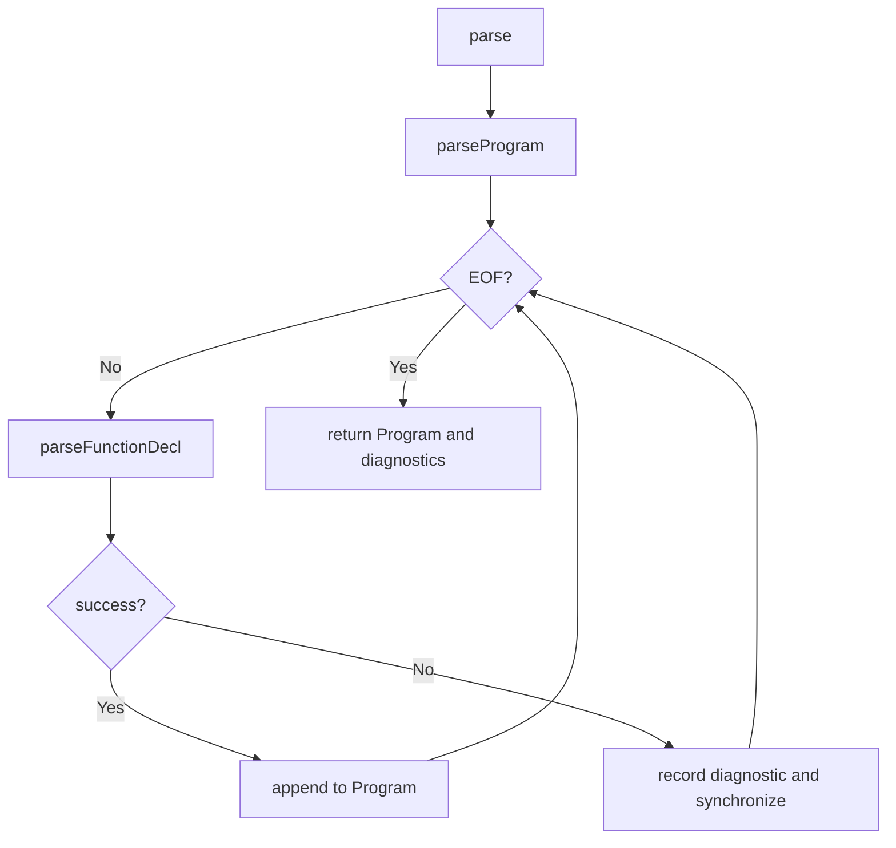

### 6.8 Notes for Future Extension

When global declarations are introduced, `parseProgram()` can be extended to dispatch between:
- function definition
- global variable declaration
- future top-level declarations

The overall control flow remains unchanged; only top-level dispatch logic expands.

---

## 7. Statement Parsing Design

This section defines how MiniC statements are parsed and mapped to AST nodes.

### 7.1 Statement Dispatcher

`parseStatement()` is the single entry point for statement parsing.

Dispatch rules are prefix-based:
- `{` -> `parseBlockStmt`
- type keyword (`int`, `float`, `char`, `string`, `void`) -> `parseDeclStmt`
- `if` -> `parseIfStmt`
- `while` -> `parseWhileStmt`
- `for` -> `parseForStmt`
- `return` -> `parseReturnStmt`
- otherwise -> `parseExprStmt`

This keeps dispatch deterministic with one-token lookahead.

### 7.2 Block Statement

Grammar:
`compound-statement = "{" statement* "}"`

`parseBlockStmt()` behavior:
- consume `{`
- repeatedly parse statements until `}` or EOF
- consume `}` and build `BlockStmt`

Recovery:
- if `}` is missing, emit diagnostic and synchronize to `}` or safe outer boundary

### 7.3 Declaration Statement

Grammar:
`declaration = type identifier ("=" expression)? ";"`

`parseDeclStmt()` behavior:
- parse type
- require identifier
- optionally parse initializer after `=`
- require trailing `;`

Notes:
- declaration parsing is syntax-only at this stage
- duplicate names or invalid type usage are semantic responsibilities

### 7.4 Expression Statement

Grammar:
`expression-statement = expression? ";"`

`parseExprStmt()` behavior:
- if current token is `;`, produce empty expression statement
- otherwise parse `expression`
- require trailing `;`

Empty expression statements are valid and represented explicitly.

### 7.5 If Statement

Grammar:
`if-statement = "if" "(" expression ")" statement ("else" statement)?`

`parseIfStmt()` behavior:
- consume `if`
- require `(`, parse condition, require `)`
- parse then-branch statement
- optionally parse else-branch when else is present

`else` binds to the nearest unmatched `if` by construction.

### 7.6 While Statement

Grammar:
`while-statement = "while" "(" expression ")" statement`

`parseWhileStmt()` behavior:
- consume `while`
- require `(`, parse condition, require `)`
- parse loop body statement

### 7.7 For Statement

Grammar:
`for-statement = "for" "(" for-init ";" for-condition? ";" for-update? ")" statement`
`for-init = declaration-no-semi | expression | ε`

`parseForStmt()` behavior:
- consume `for` and require `(`
- parse init:
    - declaration without trailing semicolon, or
    - expression, or
    - empty
- require first `;`
- parse optional condition
- require second `;`
- parse optional update
- require `)`
- parse body statement

This design supports all three common for forms:
- full form
- partially empty form
- infinite loop form (`for(;;)`)

### 7.8 Return Statement

Grammar:
`return-statement = "return" expression? ";"`

`parseReturnStmt()` behavior:
- consume `return`
- parse optional expression
- require trailing `;`
- build `ReturnStmt`

Return-type compatibility is checked later in semantic analysis.

### 7.9 Statement-Level Recovery

On statement parse failure:
- emit one primary diagnostic
- enter panic mode
- synchronize to one of:
    - `;`
    - `}`
    - statement starters (`if`, `while`, `for`, `return`, type keywords, `{`)
- produce `ErrorStmt` if needed and continue

This avoids parser lockup and reduces cascading diagnostics.

### 7.10 Statement Parsing Summary

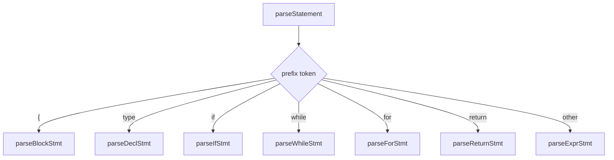

---

## 8. Expression Parsing Design

This section defines how MiniC expressions are parsed, how precedence is enforced, and how expression-level recovery works.

### 8.1 Design Approach

MiniC expression parsing uses layered recursive-descent functions, with one function per precedence level.

Why this approach:
- deterministic behavior with single-token lookahead
- direct mapping from grammar to implementation
- simple control flow and easy debugging
- natural support for precedence and associativity

### 8.2 Precedence Ladder

Expression parsing follows this order (low to high precedence):

1. assignment
2. logical-or
3. logical-and
4. equality
5. relational
6. additive
7. multiplicative
8. unary
9. postfix
10. primary

Entry chain:
- `parseExpression -> parseAssignment`

### 8.3 Associativity Rules in Parser

Rules：
- assignment is right-associative
- all supported binary operators except assignment are left-associative
- unary operators are prefix and bind tighter than binary operators
- postfix call binds tighter than unary and all binary operators

Implementation note:
- left-associative levels use loop folding (while match op, parse rhs, build new lhs)
- assignment uses recursive rhs parsing for right-associative behavior

### 8.4 Core Expression Methods

Methods and responsibilities:
- `parseExpression()`: entry point
- `parseAssignment()`: parse assignment or fallback to logical-or
- `parseLogicalOr()`: parse `||`
- `parseLogicalAnd()`: parse `&&`
- `parseEquality()`: parse `==` and `!=`
- `parseRelational()`: parse `<`, `>`, `<=`, `>=`
- `parseAdditive()`: parse `+` and `-`
- `parseMultiplicative()`: parse `*`, `/`, `%`
- `parseUnary()`: parse prefix `!`, `-`, `+`
- `parsePostfix()`: parse function call suffixes
- `parsePrimary()`: parse identifiers, literals, and parenthesized expressions

### 8.5 Assignment Parsing

Grammar:
`assignment = identifier "=" assignment | logical-or`

Behavior:
- parse lhs via `parseLogicalOr()`
- if next token is `=`, parse rhs using `parseAssignment()` (right-associative)
- build `AssignExpr(lhs, rhs)`

Validation boundary:
- parser checks assignment shape syntactically
- strict lvalue legality is validated in semantic analysis

### 8.6 Binary Operator Levels

For each binary precedence level:
- parse left operand from next-higher-precedence function
- while current token is one of this level's operators:
    - consume operator
    - parse right operand from next-higher-precedence function
    - fold into `BinaryExpr(op, left, right)`

This yields left-associative trees for all binary levels except assignment.

### 8.7 Unary Parsing

Grammar:
`unary = ("!" | "-" | "+") unary | postfix`

Behavior:
- if current token is unary operator, consume and recursively parse unary operand
- build `UnaryExpr(op, operand)`
- otherwise fallback to `parsePostfix()`

### 8.8 Postfix Call Parsing

Grammar:
`postfix = primary ("(" argument-list? ")")*`

Behavior:
- parse initial callee via `parsePrimary()`
- while next token starts a call suffix `(`:
    - parse optional argument list
    - require `)`
    - wrap current expression into `CallExpr(callee, args)`

This supports chained postfix calls syntactically (for example `f()()`), while callable validity remains a semantic-phase responsibility.

### 8.9 Primary Parsing

Grammar:
`primary = identifier | literal | "(" expression ")"`

Behavior:
- identifier -> `IdentifierExpr`
- literal token -> `LiteralExpr`
- `(` -> parse inner expression, require `)`, build `GroupingExpr`
- otherwise emit diagnostic and return `ErrorExpr`

### 8.10 Argument List Parsing

Argument list rules:
- empty list allowed: `f()`
- non-empty list: `expression ("," expression)*`

Parser behavior:
- if next token is `)`, return empty args
- otherwise parse first argument expression
- continue parsing additional arguments while commas are matched

### 8.11 Expression-Level Recovery

When expression parsing fails:
- emit one primary expression diagnostic
- return `ErrorExpr` placeholder
- synchronize to an expression boundary where possible

Expression synchronization targets typically include:
- `;`
- `)`
- `]` (reserved for future language growth)
- `}`
- `,`

This keeps statement-level parsing alive and reduces cascading errors.

### 8.12 Expression Parsing Summary

**Assignment dispatch**

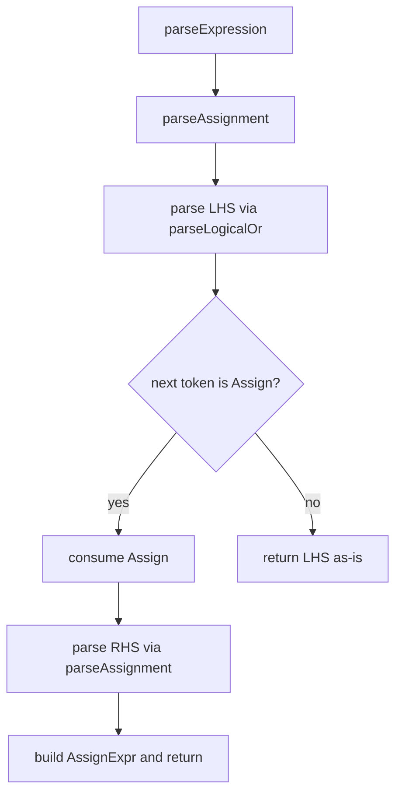

**Precedence chain**

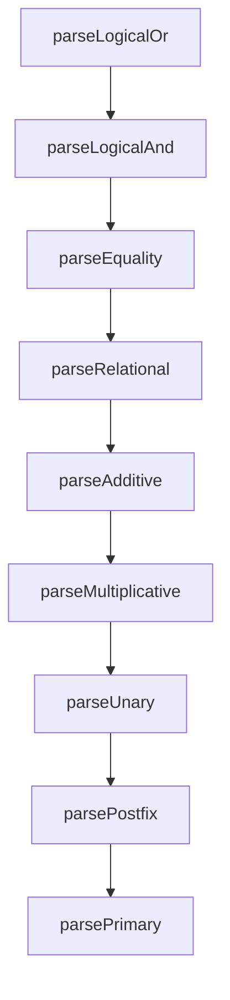

**Postfix call loop**

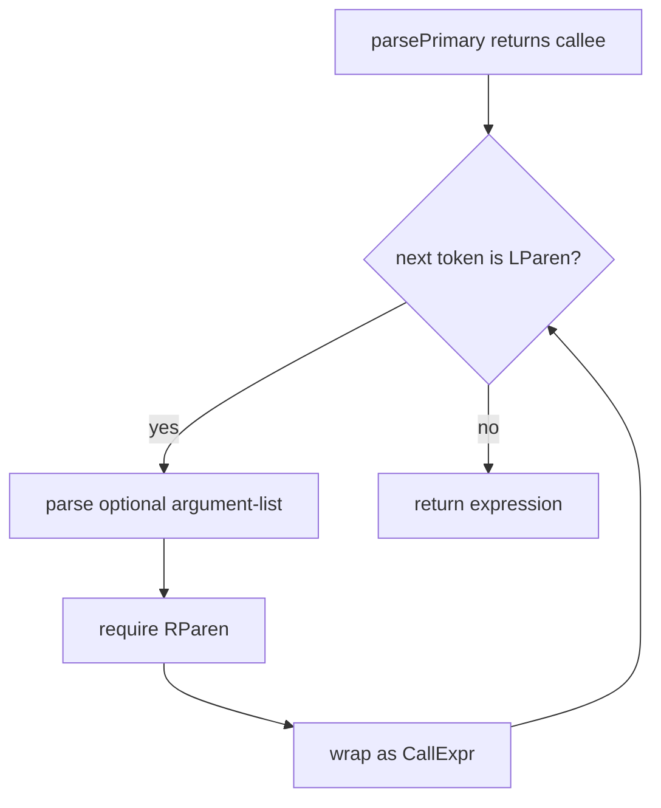

---

## 9. Error Handling and Recovery

This section defines how the MiniC parser detects, reports, and recovers from errors during parsing.

### 9.1 Error Handling Principles

The parser follows these core principles:

- report errors with accurate source position (line and column)
- continue parsing after recoverable errors to expose more issues in one run
- avoid cascading diagnostics from a single root cause
- keep error logic separated from normal parsing logic

### 9.2 Diagnostic Structure

Each diagnostic should carry:

- severity: error or warning
- source span: begin and end location
- message: human-readable description
- expected: what the parser expected
- actual: what token was found

Example message format:
`[line:col] syntax error: expected ';' after expression, got '}'`

### 9.3 Error Classes

**Unexpected token**
- the current token does not match what the grammar expects
- example: missing `;` after expression statement

**Missing token**
- a required token is absent between valid tokens
- example: missing `)` after function argument list

**Premature EOF**
- the token stream ends while still inside a construct
- example: EOF inside an unclosed block

**Lexical error token**
- the parser encounters a `TokenType::Error` produced by the lexer
- the parser records a lexical diagnostic and synchronizes

### 9.4 Panic Mode Recovery

When an error is detected:

1. record one diagnostic for the error
2. set `panicMode = true`
3. advance tokens until a synchronization point is reached
4. clear `panicMode` and resume normal parsing

While `panicMode` is active, additional diagnostics are suppressed to avoid noise.

### 9.5 Synchronization Points

Synchronization targets vary by context:

**Statement level**
- `;`
- `}`
- statement starters: `if`, `while`, `for`, `return`, type keywords, `{`

**Expression level**
- `;`
- `)`
- `}`
- `,`

**Top-level**
- type keywords that likely start a new function definition
- `}`
- EOF

### 9.6 Error Node Production

When a construct cannot be parsed:

- produce `ErrorStmt` or `ErrorExpr` as a placeholder
- preserve valid sibling nodes in the AST
- allow later passes to skip or downgrade checks on error nodes

This keeps the AST structurally sound enough for partial semantic analysis.

### 9.7 Lexical Error Handling

When the parser encounters a `TokenType::Error` token:

- record a lexical diagnostic using the token's message and source location
- treat it as an unexpected token and trigger synchronization
- do not propagate the error token into the AST

### 9.8 Error Count and Abort Policy

The parser tracks error count during a parse run.

- if `errorCount` exceeds a configured maximum (for example 50), parsing aborts early
- in that case, return the partial AST and diagnostics collected so far
- compilation control (whether to proceed to later stages) is the driver's responsibility

### 9.9 Recovery Flow Summary

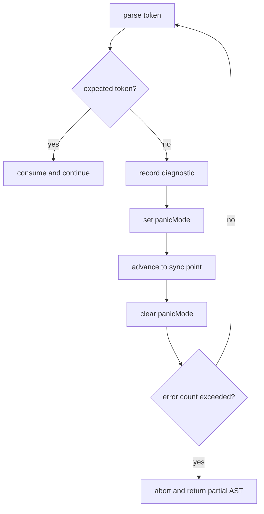

---

## 10. Integration with Existing Modules

This section defines how the parser interfaces with existing and future compiler components.

### 10.1 Interface with Lexer

The parser consumes tokens produced by the `Lexer` class via repeated calls to `nextToken()`.

Integration contract:

- the parser owns the calling loop; the lexer is stateless between calls
- the parser buffers one token of lookahead internally using `peek()`
- `TokenType::Error` tokens are handled by the parser's error path, not by the lexer
- the parser never calls into lexer internals directly

Token types used by the parser are defined in `src/lexer/include/token.h`.  
No changes to the lexer interface are required to add the parser.

### 10.2 Interface with Main / Driver

Currently `main.cpp` is a development entry point that runs the lexer only.  
When the parser is integrated, the driver flow will become:

1. read source file
2. construct `Lexer`
3. construct `Parser` with lexer reference
4. call `parser.parse()` and receive `Program` AST and diagnostics
5. check diagnostics and decide whether to proceed to semantic analysis
6. output errors and exit code

Compilation control (whether to continue after parser errors) remains the driver's responsibility.

### 10.3 Interface with Semantic Analysis

The parser's output is the sole input to the semantic analysis phase.

Contract:

- parser produces a fully allocated `Program` AST
- semantic analysis receives the root `Program` node and the diagnostics list
- semantic analysis should skip or downgrade checks on `ErrorStmt` and `ErrorExpr` nodes
- no token stream is passed to semantic analysis

### 10.4 Debug Logging

The parser should reuse the existing `debug.h` logging infrastructure.

Usage conventions:

- use `LogModule::Parser` for all parser log entries
- use `TRACE_ENTER_EXIT(LogModule::Parser)` in top-level parse methods
- use `DEBUG_LOG` for token consumption and decision points
- log level: `Debug` for token-level tracing, `Info` for function entry/exit, `Warn`/`Error` for diagnostics

### 10.5 Build Integration

When the parser module is added:

- create `src/parser/` directory with `parser.h`, `parser.cpp`, and `include/ast.h`
- add parser source files to `CMakeLists.txt` under the `minic` target
- no new CMake targets are needed for the parser itself
- parser tests use the existing `test` and `run_tests.py` infrastructure under `tests/parser/`

---

## 11. Testing Strategy

This section defines how the MiniC parser should be tested.

### 11.1 Test Layers

**Unit tests (parse function level)**
- test individual parse methods in isolation
- construct a token sequence manually and assert the resulting AST node shape
- focus on: expression precedence, associativity, statement variants, for-init variants

**Integration tests (full parse)**
- provide a `.mc` source file and assert the full `Program` AST structure
- or assert that specific diagnostics appear for invalid inputs

**End-to-end tests (driver level)**
- provide `.mc` source files under `tests/parser/`
- use the existing `run_tests.py` infrastructure
- files prefixed with `error_` are expected to produce at least one diagnostic

### 11.2 Positive Test Coverage

| Category | Examples |
|---|---|
| Function definitions | no params, multiple params, void return |
| Variable declarations | with and without initializer |
| If/else | nested, else-if chain, single branch |
| While | simple condition, nested |
| For | full form, partially empty, `for(;;)` |
| Return | with expression, without expression |
| Expressions | all operator precedence levels |
| Assignment | simple, chained right-associative |
| Function calls | no args, multiple args, chained postfix |
| Literals | int, float, char, string |
| Grouping | parenthesized expressions |

### 11.3 Negative Test Coverage

| Category | Examples |
|---|---|
| Missing semicolon | expression statement without `;` |
| Mismatched parentheses | unclosed `(` in expression or `if` condition |
| Mismatched braces | unclosed `{` in function body |
| Missing identifier | declaration with type but no name |
| Invalid for header | missing separating `;` in `for` |
| Empty primary | expression starting with unexpected token |
| Premature EOF | source cut off inside function body |
| Lexical error token | lexer produces `Error` token in stream |

### 11.4 AST Assertion Strategy

Tests should assert:

- node type of root and direct children
- key field values (operator, name, literal value)
- presence or absence of optional fields (else branch, initializer, return value)
- source span accuracy for at least the outermost node

### 11.5 Diagnostic Assertion Strategy

Error tests should assert:

- at least one diagnostic is recorded
- diagnostic message contains expected keywords (for example "expected", "';'")
- diagnostic source location is on the correct line

---

## 12. Milestones and Deliverables

### 12.1 Milestone Summary

| Milestone | Goal | Status |
|---|---|:---:|
| M1 | AST definition and expression parsing | Planned |
| M2 | Statement and function parsing | Planned |
| M3 | Error recovery and test coverage | Planned |

### 12.2 M1 — AST Definition and Expression Parsing

| | |
|---|---|
| **Goal** | Establish the core AST model and a working expression parser |

| Tasks | |
|---|---|
| Define all AST node types | `src/parser/include/ast.h` |
| Implement source location model | `SourceLocation`, `SourceSpan` |
| Implement token consumption API | `peek`, `advance`, `check`, `match`, `expect` |
| Implement full expression parsing chain | assignment through primary |
| Implement postfix call loop | `parsePostfix()` |

| Acceptance Criteria | |
|---|---|
| Expression tests pass | all operator precedence levels |
| Postfix call tests pass | single and chained calls |
| Error expressions produce placeholder | `ErrorExpr` nodes in AST |

### 12.3 M2 — Statement and Function Parsing

| | |
|---|---|
| **Goal** | Full program parsing end-to-end |

| Tasks | |
|---|---|
| Implement all statement parse methods | `parseBlockStmt` through `parseReturnStmt` |
| Implement top-level parsing | `parseProgram()` and `parseFunctionDecl()` |
| Integrate parser into driver | update `main.cpp` as second pipeline stage |
| Add parser test suite | `tests/parser/` positive test cases |

| Acceptance Criteria | |
|---|---|
| Full-program sources parse cleanly | `full_program.mc`-style sources produce no errors |
| Statement AST correctness | all statement forms produce correct node types |
| Driver integration works | `parse()` returns valid `Program` for all positive inputs |

### 12.4 M3 — Error Recovery and Test Coverage

| | |
|---|---|
| **Goal** | Robust recovery and complete test matrix |

| Tasks | |
|---|---|
| Implement panic mode | synchronization logic at statement, expression, and top-level |
| Implement error nodes | `ErrorStmt` and `ErrorExpr` production in all parse paths |
| Implement abort policy | error count threshold and early exit |
| Add negative test cases | all error classes from section 11.3 |
| Verify diagnostic accuracy | source positions correct on all error tests |

| Acceptance Criteria | |
|---|---|
| Negative tests pass | all error inputs produce expected diagnostics |
| No crash or infinite loop | parser handles any test input stably |
| Cascading suppression works | panic mode reduces diagnostic noise |
| Threshold abort works | parsing stops cleanly when error count exceeded |

---

## 13. Extension Points

This section documents where the parser is designed to grow as MiniC evolves.

| Extension | Parser Change | AST Change | Grammar Change |
|---|---|---|---|
| Global variable declarations | extend top-level dispatch in `parseProgram()` | add `GlobalDeclNode` | `program = (function-definition \| global-declaration)*` |
| Array index access | add `[` branch in `parsePostfix()` | add `IndexExpr: callee, index` | `postfix += "[" expression "]"` |
| Member access | add `.` branch in `parsePostfix()` | add `MemberExpr: object, member` | `postfix += "." identifier` |
| Pointer member access | add `->` branch in `parsePostfix()` | add `ArrowExpr: pointer, member` | `postfix += "->" identifier` |
| Compound assignment | extend `parseAssignment()` to match `+=` `-=` `*=` `/=` `%=` | none; `AssignExpr` captures operator | `assignment += identifier op= assignment` |
| Prefix increment/decrement | extend `parseUnary()` | add `UnaryOp::PrefixInc`, `PrefixDec` | `unary += "++" unary \| "--" unary` |
| Postfix increment/decrement | add `++`/`--` branch in `parsePostfix()` | add `UnaryOp::PostfixInc`, `PostfixDec` | `postfix += "++" \| "--"` |
| C++ callable chaining | already supported via postfix loop | `CallExpr.callee` already typed as `Expr` | no change needed |
| Operator overloading | no parser change needed | no change needed | resolved in semantic phase |
| Templates | requires new token types and type-parameter syntax | requires new AST nodes | significant grammar extension |