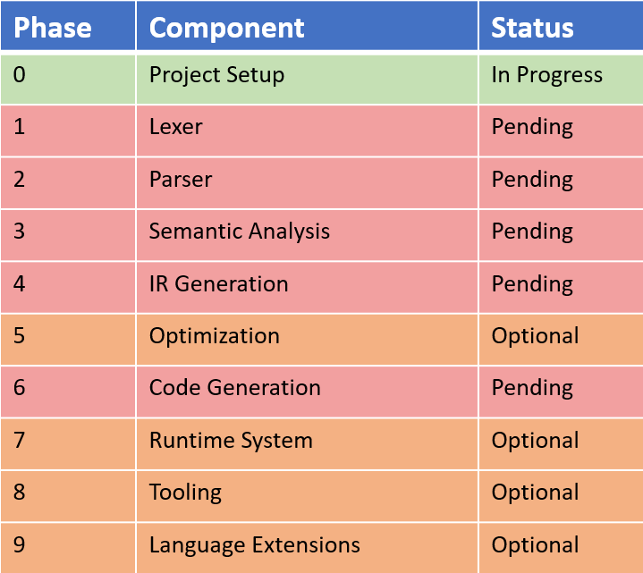

# MiniC Project Roadmap

This roadmap outlines the development plan for the MiniC compiler, from the minimal viable version to advanced features. The goal is to build the compiler in incremental, well-defined stages that ensure clarity, stability and extensibility.

---

## Milestones Summary

---

## Phase 0 - Project Setup

**Goals:**

- Establish project structure
- Create documentation framework
- Set up build system and repository

**Tasks:**

- Initialize project directory
- Add README, architecture, and specification documents
- Create 'src/' and 'tests/' directories
- Configure build tools (CMake, Makefile, or equivalent)
- Set up basic testing environment

---

## Phase 1 - Lexer (Tokenization)

**Goals:**

- Convert raw source code into a token stream
- Support all MiniC keywords, identifiers, literals and operators

**Tasks:**

- Implement character reading and buffering
- Tokenize identifiers, numbers, and operators
- Handle whitespace and comments
- Implement error reporting for invalid tokens
- Write unit tests for all token types

**Deliverables:**

- Token definitions
- Lexer implementation
- Lexer test suite

---

## Phase 2 - Parser (AST Construction)

**Goals:**

- Parse tokens into an Abstract Syntax Tree (AST)
- Implement full MiniC grammar

**Tasks:**

- Define AST node structures
- Implement recursive descent parser
- Support expressions, statements, and function definitions
- Provide syntax error reporting with line/column info
- Add parser tests for valid and invalid programs

**Deliverables:**

- AST node definition
- Parser implementation
- Parser test suite

---

## Phase 3 - Semantic Analysis

**Goals:**

- Validate the correctness of the AST
- Enforce MiniC type rules and scope rules

**Tasks:**

- Implement symbol tables and scope management
- Perform type checking
- Validate function signatures and return types
- Detect undefined variables and duplicate declarations
- Add semantic error reporting

**Deliverables:**

- Semantic analyzer module
- Symbol table implementation
- Semantic test suite

---

## Phase 4 - Intermediate Representation (IR)

**Goals:**

- Translate AST into a low-level, structured IR
- Provide a foundation for optimization and code generation

**Tasks:**

- Define IR instruction format (e.g. three-address code)
- Implement IR builder
- Generate IR for expressions, control flows, and functions
- Add IR printing/debugging utilities

**Deliverables:**

- IR specification
- IR generation module
- IR test suite

---

## Phase 5 - Optimization (Optional)

**Goals:**

- Improve IR efficiency and reduce redundancy

**Tasks:**

- Implement constant folding
- Implement dead code elimination
- Implement algebraic simplification
- Add optional optimization flags

**Deliverables:**

- Optimization passes
- Optimizer test suite

---

# Phase 6 - Code Generation

**Goals:**

- Convert IR into executable output

**Possible Targets:**

- Custom virtual machine bytecode
- Stack-based interpreter format
- Assembly for x86, ARM, or RISC-V
- WebAssembly (future option)

**Tasks:**

- Implement instruction selection
- Implement register/stack allocation
- Emit final code format
- Add runtime support if needed

**Deliverables:**

- Code geenrator module
- Target-specific backend
- Example compiled programs

---

## Phase 7 - Runtime System (Optional)

**Goals:**

- Provide built-in functions and utilities

**Tasks:**

- Implement I/O functions (print, read)
- Implement memeory helpers if needed
- Provide standard library stubs

**Delieverables:**

- Runtime library
- Documentation for built-in functions

---

## Phase 8 - Toolling & Developer Experience

**Goals:**

- Improve usability and debugging

**Tasks:**

- Add command-line interface
- Add verbose/debug modes
- Add error highlighting
- Add IR visualization tools

---

## Phase 9 - Extended Language features (Optional)

**Possible Extensions:**
- Arrays
- Strings
- Structs
- Pointers
- Modules
- Type inference
- Additional control flow constructs

These features are not part of the core MiniC Specification buy may be added as the project evolves.
